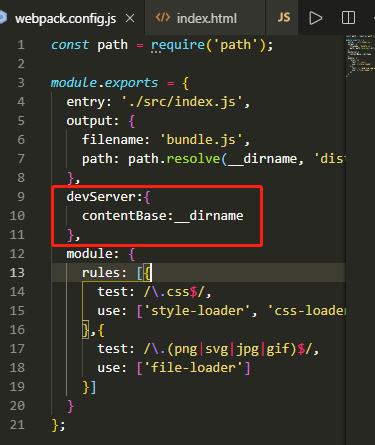

# 什么是WebPack，为什么要使用它？

## 为什要使用WebPack
现今的很多网页其实可以看做是功能丰富的应用，它们拥有着复杂的JavaScript代码和一大堆依赖包。为了简化开发的复杂度，前端社区涌现出了很多好的实践方法

+ **模块化**，让我们可以把复杂的程序细化为小的文件;
+ 类似于TypeScript这种在JavaScript基础上拓展的开发语言：使我们能够实现目前版本的JavaScript不能直接使用的特性，并且之后还能转换为JavaScript文件使浏览器可以识别；
+ Scss，less等CSS预处理器...

这些改进确实大大的提高了我们的开发效率，但是利用它们开发的文件往往需要进行额外的处理才能让浏览器识别,而手动处理又是非常繁琐的，这就为WebPack类的工具的出现提供了需求。

## 什么是Webpack
WebPack可以看做是模块打包机：它做的事情是，分析你的项目结构，找到JavaScript模块以及其它的一些浏览器不能直接运行的拓展语言（Scss，TypeScript等），并将其转换和打包为合适的格式供浏览器使用。

## WebPack和Grunt以及Gulp相比有什么特性
其实Webpack和另外两个并没有太多的可比性，Gulp/Grunt是一种能够优化前端的开发流程的工具，而WebPack是一种模块化的解决方案，不过Webpack的优点使得Webpack在很多场景下可以替代Gulp/Grunt类的工具。
Grunt和Gulp的工作方式是：在一个配置文件中，指明对某些文件进行类似编译，组合，压缩等任务的具体步骤，工具之后可以自动替你完成这些任务。

Webpack的工作方式是：把你的项目当做一个整体，通过一个给定的主文件（如：index.js），Webpack将从这个文件开始找到你的项目的所有依赖文件，使用loaders处理它们，最后打包为一个（或多个）浏览器可识别的JavaScript文件。

如果实在要把二者进行比较，Webpack的处理速度更快更直接，能打包更多不同类型的文件。

# 开始使用Webpack
初步了解了Webpack工作方式后，我们一步步的开始学习使用Webpack。

## 安装
Webpack可以使用npm安装，新建一个空的练习文件夹（此处命名为webpack），在终端中转到该文件夹后执行下述指令就可以完成安装。

```
//全局安装
npm install -g webpack
//安装到你的项目目录
npm install --save-dev webpack
//如果使用的是webpack v4或更高版本，则需要安装CLI。
npm install --save-dev webpack-cli
```

## 使用
首先让创建一个目录，初始化npm，在本地安装webpack，然后安装webpack-cli（用于在命令行上运行webpack的工具）

```
mkdir webpack && cd webpack
npm init -y
npm install webpack webpack-cli --save-dev
```

现在创建以下目录结构，文件及其内容
```
webpack
  |- package.json
  |- webpack.config.js
  |- index.html
  |- /src
    |- index.js
```

src/index.js

```
function component() {
  var element = document.createElement('div');
  element.innerHTML = 'Hello webpack';
  return element;
}

document.body.appendChild(component());
```

index.html

```
<!doctype html>
<html>
  <head>
    <title>Getting Started</title>
    <script src="https://unpkg.com/lodash@4.16.6"></script>
  </head>
  <body>
    <script src="./dist/bundle.js"></script>
  </body>
</html>
```

webpack.config.js

```
const path = require('path');

module.exports = {
  entry: './src/index.js',
  output: {
    filename: 'bundle.js',
    path: path.resolve(__dirname, 'dist')
  }
};
```

### 运行构建
`npx webpack --config webpack.config.js`


### NPM Scripts
通过添加一个npm脚本来调整package.json,就可以使用npm run build命令来代替npx之前使用的命令。


# webpack管理像图像和字体等静态资源
## 加载CSS
为了import从JavaScript模块中获取CSS文件，您需要安装style-loader和css-loader并将其添加到您的module配置中：

`npm install --save-dev style-loader css-loader`

webpack.config.js添加如下代码段:


webpack使用正则表达式来确定应该查找哪些文件并将其提供给特定的加载程序。在这种情况下，任何以文件结尾的文件.css将被提供给style-loader和css-loader
这使您能够import './style.css'进入依赖于该样式的文件。现在，当该模块运行时，`<style>`带有字符串化CSS 的标签将被插入到您的html文件中。

在src目录下新建style.css文件，并在index.js中引用


现在运行你的build命令,再次打开浏览器，页面字体变为红色

## 加载图片
`npm install --save-dev file-loader`

webpack.config.js添加如下代码段:


src/index.js


执行npm run build,dist文件夹会出现一个.png的图片，这意味着webpack在文件src夹中找到我们的文件并进行处理！

打开浏览器：


由于直接通过文件打开，获取图片会有路径问题，所以接下来使用webpack-dev-server搭建本地服务器

`npm install --save-dev webpack-dev-server`

webpack.config.js



package.json


执行npm start


# webpack输出管理

## webpack文件输出管理

到目前为止，我们在 index.html 文件中手动引入所有资源，然而随着应用程序增长，并且一旦开始对文件名使用哈希(hash)]并输出多个 bundle，手动地对 index.html 文件进行管理，一切就会变得困难起来。然而，可以通过一些插件，会使这个过程更容易操控。

+ 新增文件print.js并添加内容
```
export default function printMe() {
    console.log('I get called from print.js!');
}
```

+ src/index.js


+ webpack.config.js


+ index.html


+ 构建并运行webpack-dev-server
```
npm run build
npm start
```

可以看到，webpack 生成 print.bundle.js 和 app.bundle.js 文件，这也和我们在 index.html 文件中指定的文件名称相对应。如果你在浏览器中打开 index.html，就可以看到在点击按钮时会发生什么。

但是如果我们改变了某个入口点的名称，甚至添加了新的入口点，生成的包将在构建时重命名，但我们的index.html文件仍然会引用旧名称，可以使用HtmlWebpackPlugin解决这个问题。

## HtmlWebpackPlugin
+ 安装插件

`npm install --save-dev html-webpack-plugin`

+ 调整webpack.config.js文件


+ 构建

`npm run build`

dist目录中生成了新的index.html

像代码示例中的那样，我们的/dist文件夹变得非常混乱。Webpack将生成这些文件并将它们放在/dist文件夹中，但它不会跟踪项目实际使用哪些文件。

通常最好/dist在每次构建之前清理文件夹，以便仅生成已使用的文件。

一个流行的插件来管理这个是clean-webpack-plugin

## 清理/dist文件夹
+ 安装clean-webpack-plugin

`npm install clean-webpack-plugin --save-dev`

webpack.config.js


现在执行 npm run build，再检查 /dist 文件夹。如果一切顺利，你现在应该不会再看到旧的文件，只有构建后生成的文件！

# 搭建开发环境

## 为什么使用source map
当 webpack 打包源代码时，可能会很难追踪到错误和警告在源代码中的原始位置。例如，如果将三个源文件（a.js, b.js 和 c.js）打包到一个 bundle（bundle.js）中，而其中一个源文件包含一个错误，那么堆栈跟踪就会简单地指向到 bundle.js。这并通常没有太多帮助，因为你可能需要准确地知道错误来自于哪个源文件。

为了更容易地追踪错误和警告，JavaScript 提供了 source map 功能，将编译后的代码映射回原始源代码。如果一个错误来自于 b.js，source map 就会明确的告诉你。
### devtool选项


+ 以下选项非常适合开发

- eval- 每个模块都以eval()和执行//@ sourceURL。这很快。主要缺点是它不能正确显示行号，因为它被映射到转码代码而不是原始代码（来自加载程序的无源映射）。

- eval-source-map- 每个模块执行eval()并且一个SourceMap被添加为一个DataUrl给eval()。最初它很慢，但它提供了快速的重建速度并生成真正的文件。行号被正确映射，因为它被映射到原始代码。它产生了用于开发的最佳质量的SourceMaps。

- cheap-eval-source-map- 类似于eval-source-map每个模块执行eval()。这比eval-source-map快，因为它没有列映射，它只映射行号。它忽略来自Loaders的SourceMaps并仅显示类似于devtool的传输代码eval。

- cheap-module-eval-source-map与cheap-eval-source-map类似，在这种情况下，来自加载程序的源代码地图会得到更好的结果。然而，Loader Source Maps简化为每行一个映射。

 以下选项对于开发和生产并不理想。它们是一些特殊情况下需要的，也就是说对于一些第三方工具

- inline-source-map - 将一个SourceMap作为DataUrl添加到该包中。

- cheap-source-map - 没有列映射的SourceMap忽略加载器源映射。

- inline-cheap-source-map- 类似于cheap-source-mapSourceMap ，但将其作为DataUrl添加到捆绑包中。

- cheap-module-source-map - 一个没有列映射的SourceMap，它简化了加载器源映射到每行一个映射。

- inline-cheap-module-source-map- 类似于cheap-module-source-mapSourceMap ，但将其作为DataUrl添加到捆绑包中

这些选项通常用于生产中

- (none)（省略devtool选项） - 不发射SourceMap。这是一个很好的选择。

- source-map - 完整的SourceMap作为单独的文件发出。它为该包添加了一个引用，以便开发工具知道在哪里可以找到它。您应该将您的服务器配置为不允许对普通用户访问源映射文件！。

- hidden-source-map- 与此相同source-map，但不会为该包添加引用。如果您只希望SourceMaps从错误报告中映射错误堆栈跟踪，但不希望为浏览器开发工具公开您的SourceMap，则很有用。您不应将源映射文件部署到Web服务器。而只能将其用于错误报告工具。

- nosources-source-map- 一个SourceMap是在没有sourcesContent它的情况下创建的。它可以用来映射客户端上的堆栈跟踪，而不用公开所有的源代码。您可以将源映射文件部署到Web服务器。它仍然公开反编译的文件名和结构，但它不公开原始代码。

+ 注意点
在使用时，uglifyjs-webpack-plugin您必须提供sourceMap: true启用S​​ourceMap支持的选项。

示例使用 inline-source-map 选项


现在让我们确保我们有一些东西要调试，所以让我们在我们的print.js文件中创建一个错误：

src/print.js


构建运行

`npm start`


## 每次要编译代码时，手动运行 npm run build 就会变得很麻烦。
webpack 中有几个不同的选项，可以帮助你在代码发生变化后自动编译代码：

1. webpack's Watch Mode
2. webpack-dev-server
3. webpack-dev-middleware

多数场景中，可能需要使用 webpack-dev-server

webpack.config.js


注意，我们还添加了 NamedModulesPlugin，以便更容易查看要修补(patch)的依赖。在起步阶段，我们将通过在命令行中运行 npm start 来启动并运行 dev server。

现在我们来修改 index.js 文件，以便当 print.js 内部发生变更时可以告诉 webpack 接受更新的模块。

index.js


更改print.js


console


# 搭建生产环境

### 为什么要每个环境编写单独的webpack配置

开发环境(development)和生产环境(production)的构建目标差异很大。在开发环境中，我们需要具有强大的、具有实时重新加载(live reloading)或热模块替换(hot module replacement)能力的 source map 和 localhost server。而在生产环境中，我们的目标则转向于关注更小的 bundle，更轻量的 source map，以及更优化的资源，以改善加载时间。由于要遵循逻辑分离，我们通常建议为每个环境编写彼此独立的 webpack 配置。

虽然，以上我们将生产环境和开发环境做了略微区分，但是，请注意，我们还是会遵循不重复原则(Don't repeat yourself - DRY)，保留一个“通用”配置。为了将这些配置合并在一起，我们将使用一个名为 webpack-merge 的工具。通过“通用”配置，我们不必在环境特定(environment-specific)的配置中重复代码。

#### 安装webpack-merge、uglifyjs-webpack-plugin（压缩插件）

`npm install --save-dev webpack-merge`
`npm install --save-dev uglifyjs-webpack-plugin`

#### 删除webpack.config.js，创建webpack.common.js、webpack.dev.js、webpack.prod.js

+ webpack.common.js
```
const path = require('path');
const { CleanWebpackPlugin } = require('clean-webpack-plugin');
const HtmlWebpackPlugin = require('html-webpack-plugin');

module.exports = {
    entry: {
        app: './src/index.js'
    },
    plugins: [
        new CleanWebpackPlugin(),
        new HtmlWebpackPlugin({
            title: 'Production'
        })
    ],
    output: {
        filename: '[name].bundle.js',
        path: path.resolve(__dirname, 'dist')
    },
    module: {
        rules: [{
          test: /\.css$/,
          use: ['style-loader', 'css-loader']
        },{
          test: /\.(png|svg|jpg|gif)$/,
          use: ['file-loader']
        }]
      }
};
```

+ webpack.dev.js
```
const merge = require('webpack-merge');
const common = require('./webpack.common.js');

 module.exports = merge(common, {
   mode: 'development',
   devtool: 'inline-source-map',
   devServer: {
     contentBase: './dist'
   }
 });
 ```

+ webpack.prod.js
```
 const merge = require('webpack-merge');
 const common = require('./webpack.common.js');
 const UglifyJSPlugin = require('uglifyjs-webpack-plugin');

 module.exports = merge(common, {
   devtool: 'source-map',
   mode: 'production',
   plugins: [
     new UglifyJSPlugin({
       sourceMap: true
     })
    ]
 });
 ```

 在webpack.common.js中，我们配置了entry和output安装程序，并且已经包含了两种环境都需要的插件。在webpack.dev.js，已经设置mode到development。还有添加了推荐devtool为环境（强源映射），以及我们的简单devServer配置。最后，在webpack.prod.js，mode被设置到production，生产中启用源映射，因为它们对于调试以及运行基准测试非常有用。也就是说，你应该选择一个生产速度相当快的建议速度（请参阅devtool），我们将使用生产中的source-map。避免在生产中使用 inline-*** 和 eval-***，因为它们可以增加 bundle 大小，并降低整体性能

 package.json

 

### 定义环境变量
许多 library 将通过与 process.env.NODE_ENV 环境变量关联，以决定 library 中应该引用哪些内容。例如，当不处于生产环境中时，某些 library 为了使调试变得容易，可能会添加额外的日志记录(log)和测试(test)。其实，当使用 process.env.NODE_ENV === 'production' 时，一些 library 可能针对具体用户的环境进行代码优化，从而删除或添加一些重要代码。我们可以使用 webpack 内置的 DefinePlugin 为所有的依赖定义这个变量

+ webpack.prod.js


如果你正在使用像 react 这样的 library，那么在添加此 DefinePlugin 插件后，你应该看到 bundle 大小显著下降。还要注意，任何位于 /src 的本地代码都可以关联到 process.env.NODE_ENV 环境变量，所以以下检查也是有效的：

+ src/index.js


运行npm start


# 代码分离

### 有三种方法拆分代码

1. 入口起点：使用entry配置手动分割代码。
2. 防止重复：使用SplitChunks重复数据删除和拆分块。
3. 动态导入：通过模块内的内联函数调用来分割代码（这种不会讲到，有兴趣可以自行了解）

#### 入口起点

+ 创建一个another.js文件
```
import printMe from './print';

printMe();
```
+ webpack.common.js


+ 运行 npm run build


如上图所示，print.js中printMe模块被分别重复导入another.bundle.js和app.bundle.js，让我们通过使用SplitChunks插件删除这个重复。

#### 防止重复
webpack 4 移除 CommonsChunkPlugin，取而代之的是两个新的配置项（optimization.splitChunks 和 optimization.runtimeChunk），SplitChunks允许我们共同的依赖提取到一个现有的条目块或一个全新的块。

+ webpack.common.js


webpack根据下述条件自动进行代码块分割：

+ 新块可以共享或模块来自node_modules文件夹
+ 新的块将大于30kb（min + gz之前）
+ 按需加载块时的最大并行请求数将会小于或等于5
+ 初始页面加载时的最大并行请求数量将小于或等于3

当试图满足最后两个条件时，更大的块是首选

由于print.js小于30kb，所以不会分割。所以加入splitChunks.minSize 参数
splitChunks.minSize 要生成的块的最小大小(以b为单位)

+ 修改webpack.common.js


+ 运行 npm run build


another.bundle.js和app.bundle.js的公共模块print.js中printMe模块已经形成一个单独的文件another~app.bundle.js。